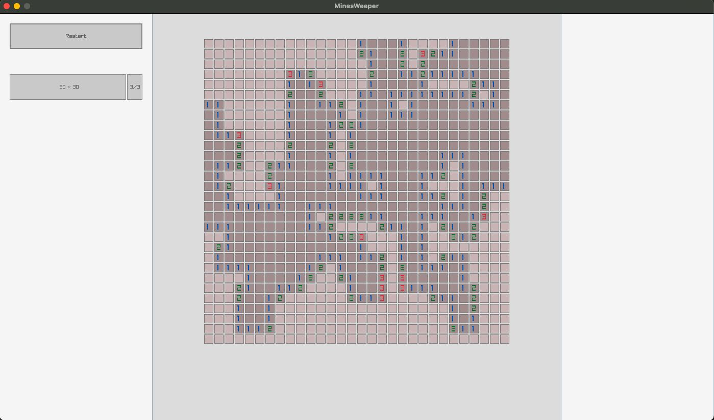

# campo minado usando a lib raylib

Quis criar um jogo simple pra testar algumas coisas com essa lib pra c, então campo minado por ter regras simples mas mesmoa ssim possuir uma espécie de tabuleiro ficou bem bacana.

tenho que descrever melhor mas basicamente os passos pra rodar esse jogo são:

1 - intalar a dependencia que é a raylib

```sh
brew install raylib
```

2 - compilar o binario

```sh
make
```

3 - executar o jogo

```sh
./hocus_pocus
```

4 - jogo executando


